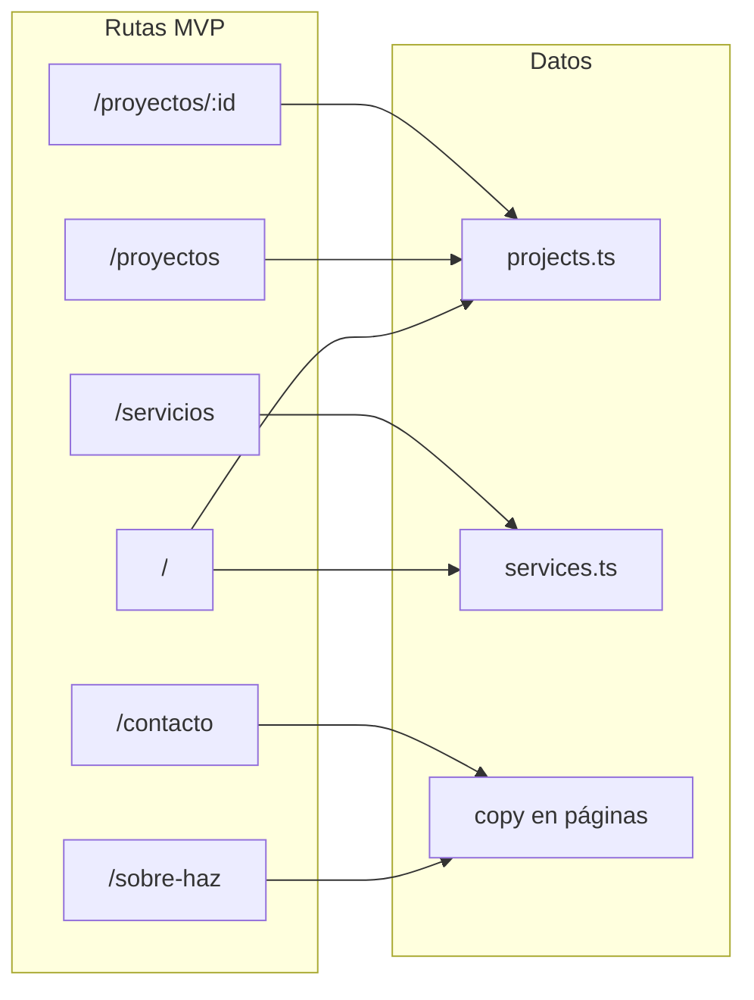

# Technical Brief — MVP portafolio (Hugo)

---

## 1. Título de la tarea

**MVP sitio portafolio + servicios + contacto para el arquitecto Hugo**

Implementar y dejar en producción un sitio web **sencillo y funcional** que sirva como **portafolio de proyectos** (fotografías y descripción breve por obra), **presentación de servicios**, **información del estudio/empresa** y **canal de contacto** para clientes. El contenido y las imágenes **ya fueron compartidos** por Hugo; el trabajo consiste en integrarlos en la base de código existente, **refactorizar la página de inicio** para que no promueva Clientes ni Prensa, y **ajustar cabecera, pie y rutas** al alcance acordado.

*“Sencillo” en este MVP se refiere al **alcance funcional y de contenido** visible para el visitante, no a un stack mínimo de dependencias:* el repositorio puede conservar temporalmente librerías heredadas (p. ej. Radix/shadcn); su depuración es opcional y posterior.

El nombre comercial que se muestra en la interfaz (hoy “HAZ Arquitectura” en cabecera, pie y metadatos) debe **actualizarse** al nombre del estudio y al tono de copy que Hugo defina.

> **Pregunta guía:** ¿Se puede describir la tarea en una sola frase? Sí: *sustituir el contenido demo en las rutas MVP por el material real de Hugo, eliminar Clientes y Prensa de toda la superficie pública (incluida la home), y desplegar una SPA lista para clientes.*

---

## 2. Contexto

Hugo, arquitecto, necesita una página web para **mostrar su obra**, **explicar qué servicios ofrece**, **dar contexto de su empresa/estudio** y **facilitar el contacto** de clientes potenciales. Los recursos (textos e imágenes) **ya están disponibles**; el objetivo no es un portal complejo, sino una presencia **clara, profesional y mantenible**.

### Cómo está el sistema hoy

El repositorio es una **SPA** generada inicialmente con Lovable, basada en **Vite + React 18 + TypeScript**, con **React Router**, **Tailwind CSS** y un conjunto amplio de componentes tipo **shadcn/ui** (primitivas Radix). Los datos de negocio viven en **`src/data/`** como módulos TypeScript; las imágenes de proyectos se referencian principalmente con **importaciones de Vite** desde **`src/assets/projects/`** (no solo desde `public/`).

La aplicación ya define **más rutas y enlaces** de los necesarios para este MVP: existen páginas y enlaces a **Clientes** y **Prensa**, que **no forman parte** del alcance actual. Además, la página de inicio ([`src/pages/Index.tsx`](src/pages/Index.tsx)) incluye **secciones completas** de clientes y prensa con enlaces a `/clientes` y `/prensa`; eso contradice el alcance si solo se actualizan cabecera y pie. La cabecera ([`src/components/layout/Header.tsx`](src/components/layout/Header.tsx)) y el pie ([`src/components/layout/Footer.tsx`](src/components/layout/Footer.tsx)) deben alinearse al menú reducido, y la **home debe dejar de mostrar ni enlazar** esas secciones.

### Problema a resolver

Sin actualizar contenido y alcance, el sitio sigue mostrando **textos e imágenes de demostración** y una estructura **más amplia** que la acordada, lo que dispersa el mensaje y no refleja el estudio de Hugo.

### Objetivo de esta implementación

Sustituir el contenido demo por el **material entregado por Hugo** en todas las **rutas y bloques del MVP**, restringir la **experiencia pública** a **Inicio**, **Proyectos** (listado y ficha), **Servicios**, **Sobre el estudio** y **Contacto**, **sin ningún camino ni CTA hacia Clientes o Prensa** (ni en home, ni en cabecera, ni en pie, ni en cuerpo de otras páginas MVP), y dejar el proyecto **listo para build y deploy** (por ejemplo en Vercel), con criterios de contacto e imágenes **verificables**.

### Estado actual del código (referencia rápida)

- **Rutas registradas** en [`src/App.tsx`](src/App.tsx): `/`, `/proyectos`, `/proyectos/:id`, `/servicios`, `/sobre-haz`, `/clientes`, `/prensa`, `/contacto`, `/_internal/design-system`, comodín `*` → 404.
- **Detalle de proyecto:** parámetro de ruta **`id`** (no `slug`), resolución con `getProjectById` en [`src/data/projects.ts`](src/data/projects.ts).
- **Metadatos por página:** [`src/components/SEO.tsx`](src/components/SEO.tsx) con **`react-helmet-async`**; el proveedor está en [`src/main.tsx`](src/main.tsx). Metadatos base también en [`index.html`](index.html).
- **Contacto:** [`src/pages/Contact.tsx`](src/pages/Contact.tsx) incluye formulario con **envío simulado** (toast); no hay backend.
- **Deploy:** no existe aún **`vercel.json`** en el repositorio (headers de seguridad y rewrites para SPA son recomendables antes de producción).
- **`public/`:** existe [`public/robots.txt`](public/robots.txt); **no** hay `sitemap.xml` en el momento de redactar este brief.

### Alcance de páginas del MVP

| Incluido en MVP | Ruta | Notas |
|-----------------|------|--------|
| Inicio | `/` | Hero, destacados de proyectos, servicios y proceso; **sin** secciones ni enlaces a Clientes o Prensa (hoy presentes en [`src/pages/Index.tsx`](src/pages/Index.tsx); deben eliminarse o sustituirse por contenido acotado al MVP) |
| Proyectos | `/proyectos` | Listado; sin requisito de filtros avanzados salvo lo que ya implemente el código |
| Detalle de proyecto | `/proyectos/:id` | `id` coincide con el campo `id` de cada proyecto en datos |
| Servicios | `/servicios` | Contenido desde [`src/data/services.ts`](src/data/services.ts) (incluye `processSteps` si la página los usa) |
| Sobre el estudio | `/sobre-haz` | Información de empresa; ruta puede mantenerse aunque el slug cambie en una iteración posterior |
| Contacto | `/contacto` | Ver definición de “contacto funcional” en Constraints |

| Fuera del MVP (post-MVP o no enlazar) | Ruta |
|--------------------------------------|------|
| Clientes | `/clientes` |
| Prensa | `/prensa` |

**Política recomendada para `/clientes` y `/prensa`:** además de quitar enlaces, **eliminar las rutas del router** en [`App.tsx`](src/App.tsx) y responder con **404** si alguien accede por URL antigua (o redirigir a `/` con criterio único documentado). Así el `sitemap.xml` y la realidad del sitio coinciden: esas URLs **no** son parte del producto MVP.

La ruta `/_internal/design-system` puede permanecer para desarrollo; **no** debe aparecer en menú público, pie ni sitemap del MVP.

### Gestión del contenido entregado por Hugo

| Tipo | Destino típico en código | Responsable |
|------|---------------------------|-------------|
| Textos de inicio, sobre, servicios | Páginas y/o `src/data/*.ts` según donde esté hoy cada bloque | Desarrollador |
| Proyectos (título, descripción, año, ubicación, imágenes, etc.) | [`src/data/projects.ts`](src/data/projects.ts) + assets bajo `src/assets/projects/` (o convención acordada) | Desarrollador |
| Servicios (títulos, descripciones, ítems, proceso) | [`src/data/services.ts`](src/data/services.ts) | Desarrollador |
| Datos de contacto reales | [`src/pages/Contact.tsx`](src/pages/Contact.tsx), pie y metadatos según diseño | Desarrollador |
| Clientes y Prensa | **No** forman parte del MVP: **no** hace falta sustituir `clients.ts` / `press.ts` por contenido real; basta con **dejar de importarlos y de mostrarlos** en la UI. Los archivos pueden permanecer en el repo para post-MVP o eliminarse si el equipo prefiere evitar código muerto. | Desarrollador |

Dudas de contenido se resuelven **directamente con Hugo**.

---

## 3. Requerimientos técnicos

### Lenguaje / Stack

> **Preguntas guía:** ¿Se continúa con el stack existente? Sí, salvo decisiones explícitas de refactor posterior.

- **Lenguaje:** TypeScript. El proyecto actual declara **`strict: false`** en [`tsconfig.app.json`](tsconfig.app.json); para el MVP se exige **tipado en datos y componentes tocados** y **no introducir `any` innecesario** en código nuevo o modificado. Activar **`strict` de forma gradual** es objetivo **post-MVP**, salvo decisión explícita de alcance.
- **Runtime de desarrollo/build:** Node.js **18+** recomendado (compatible con Vite 5).
- **Framework:** React 18.
- **Bundler:** Vite.
- **Enrutamiento:** React Router v6.
- **Estilos:** Tailwind CSS; componentes UI actuales basados en **Radix / shadcn** donde ya existan.
- **Metadatos:** `react-helmet-async` + `index.html` para valores globales.
- **Datos:** archivos TypeScript en `src/data/`; sin backend ni CMS en el MVP.
- **Estado remoto / formularios:** `@tanstack/react-query` está presente en la app; para el MVP de contacto **no** se exige API. La limpieza de dependencias no usadas puede planificarse **después** del primer despliegue con contenido real.

### Calidad y verificación

- **ESLint:** el repositorio expone **`npm run lint`** ([`eslint.config.js`](eslint.config.js)). El cierre del MVP debe completar **lint sin errores**.
- **Tests:** **Vitest** está integrado (`npm run test`, [`vitest.config.ts`](vitest.config.ts)); hay entorno **jsdom** y setup en [`src/test/setup.ts`](src/test/setup.ts). Se espera una **suite mínima útil** para el MVP (p. ej. pruebas de helpers en [`src/data/projects.ts`](src/data/projects.ts) como `getProjectById` o lógica de proyectos publicados), no solo el test de ejemplo; el test placeholder **no** cuenta como cobertura significativa.
- **CI (recomendado):** en cuanto exista flujo con PRs, conviene un pipeline que ejecute **lint + test + build**; no se exige proveedor concreto en el MVP.
- **Formato (post-MVP):** **Prettier** u otras reglas de formato unificadas son **recomendación posterior**; no están en las dependencias actuales del proyecto.

### Arquitectura

> **Pregunta guía:** ¿Patrón principal? **SPA estática:** `npm run build` genera `dist/` con assets estáticos; el servidor debe servir `index.html` para rutas de aplicación (rewrite en hosting).

- **SPA:** una sola carga de aplicación; las rutas las resuelve el cliente.
- **Organización:**
  - [`src/pages/`](src/pages/) — vistas por ruta
  - [`src/components/layout/`](src/components/layout/) — layout, cabecera, pie
  - [`src/components/`](src/components/) — bloques reutilizables (p. ej. proyectos, SEO, imágenes)
  - [`src/data/`](src/data/) — datos de negocio
  - [`src/lib/`](src/lib/) — utilidades
- **Punto de entrada de rutas:** [`src/App.tsx`](src/App.tsx).
- **404:** ruta comodín `*` hacia [`src/pages/NotFound.tsx`](src/pages/NotFound.tsx). Los textos de esa vista deben estar en **español** (hoy parte del copy está en inglés y debe corregirse). Un `id` de proyecto inexistente puede mostrar mensaje propio dentro del layout en la página de detalle (comportamiento actual).

Flujo de datos **objetivo** (la home consume varios módulos; no solo proyectos):



### Input esperado

No hay API externa: el **input** es el **conjunto de datos y archivos** que el desarrollador incorpora al repo siguiendo las estructuras ya definidas.

**Proyectos** — tipos y campos definidos en [`src/data/projects.ts`](src/data/projects.ts) (resumen):

```typescript
// Modelo actual (simplificado; ver archivo fuente para el contrato completo)
interface Project {
  id: string;
  name: string;
  location: string;
  year: number;
  type: ProjectType;
  role: ProjectRole;
  status: ProjectStatus;
  featured: boolean;
  published: boolean;
  coverImage: string;  // típicamente módulo importado (Vite)
  images: {
    url: string;
    caption?: string;
    stage: 'completed' | 'in-progress';
  }[];
  client?: string;
  area?: string;
  team?: string[];
  description: string;
  challenge?: string;
  solution?: string;
  result?: string;
  deliverables?: string[];
}
```

**Servicios** — en [`src/data/services.ts`](src/data/services.ts):

```typescript
interface Service {
  id: string;
  title: string;
  description: string;
  icon: string;        // nombre alineado con iconos Lucide usados en la página
  features: string[];
}

// Además: processSteps[] (pasos de proceso) usados en la vista de servicios
```

**Origen:** textos e imágenes proporcionados por Hugo. Las imágenes nuevas deben integrarse respetando el mecanismo de build (importaciones desde `src/assets/...` o, si se acuerda otro patrón, documentar ese acuerdo en el PR/commit).

### Output esperado

- **Build:** `npm run build` produce `dist/` sin errores de TypeScript.
- **Navegación MVP:** todas las rutas incluidas responden con la vista esperada; **no** hay enlaces en **ninguna página del MVP** (incluida la home) ni en cabecera ni pie hacia `/clientes` ni `/prensa`.
- **SEO:** título y descripción globales en `index.html`; páginas que usen `<SEO />` siguen definiendo título/descripción por vista vía `react-helmet-async`.
- **Limitación conocida (SPA sin pre-render):** los crawlers que no ejecutan JavaScript pueden ver HTML mínimo; Open Graph por URL puede no reflejar el título específico de cada página hasta una fase con pre-render o SSR. Para el MVP se acepta esta limitación salvo que se acuerde lo contrario.

---

## 4. Constraints (Restricciones)

### Idioma y alcance de contenido

- Todo el contenido visible orientado al usuario final debe estar en **español** (salvo nombres propios), **incluida la página 404** ([`NotFound.tsx`](src/pages/NotFound.tsx)).
- En las **rutas y secciones del MVP**, sustituir el contenido demo por el material **real de Hugo**.
- **Clientes** y **Prensa** no son rutas MVP: **no** se exige reemplazar sus datos demo por contenido real; se exige **que no formen parte del producto** (sin secciones, sin imports en la home, sin enlaces; ver tabla de gestión de contenido).

### Navegación y pie

- **Cabecera y pie:** solo enlaces a **Inicio** (marca), **Proyectos**, **Servicios**, **Sobre el estudio**, **Contacto** (más CTA a contacto si aplica). **Eliminar** enlaces a **Clientes** y **Prensa**.
- **Todas las páginas MVP:** no deben contener `Link`, botones ni textos que envíen a `/clientes` o `/prensa` (revisar especialmente [`src/pages/Index.tsx`](src/pages/Index.tsx) y cualquier bloque reutilizado).
- **Rutas `/clientes` y `/prensa`:** **recomendado** eliminarlas del router y tratar URLs antiguas con **404** (o redirección acordada). Si por error temporal permanecieran registradas, tampoco deben aparecer en sitemap ni en la UI.

### Contacto funcional (MVP)

- Debe mostrarse **información de contacto real** de Hugo (correo, teléfono y/o enlaces acordados, ubicación si aplica), **coherente** en la página de contacto y en el pie (hoy el pie incluye un correo demo).
- El **formulario actual no envía datos a servidor.** Para el MVP, o bien:
  - se **documenta** que el envío en servidor es **post-MVP** y se ofrece contacto vía **mailto**, teléfono clicable o WhatsApp; o
  - se retira el formulario y solo quedan canales directos.
  La opción elegida debe quedar **explícita** en el PR y cumplir el DoD.
- Si se **mantiene** el formulario sin backend: aplicar **validación en cliente** coherente con las librerías del proyecto (p. ej. **Zod**, ya presente en [`package.json`](package.json)). Cualquier **envío real** a API, sanitización en servidor y medidas como **rate limiting** quedan **post-MVP** y deben diseñarse entonces de forma explícita.

### Imágenes

- Sustituir imágenes demo por las **entregadas por Hugo**, con **texto alternativo** (`alt`) descriptivo.
- Respetar el patrón técnico del proyecto (p. ej. imports desde `src/assets/projects/` para que Vite optimice en build).
- Evitar **CLS** grave: donde sea posible, reservar espacio (p. ej. aspect-ratio o altura mínima) en contenedores de imagen.

### Código y dependencias

- Mantener **tipado TypeScript** en datos y componentes tocados.
- **No** es obligatorio en el MVP eliminar shadcn/Radix ni `react-query`; una **fase posterior** puede reducir dependencias no usadas.

### Seguridad en despliegue y cliente

- **Headers HTTP** (configuración en [`vercel.json`](vercel.json) u host equivalente), además del rewrite SPA: definir políticas **verificables** en producción. Referencia mínima para el MVP:
  - **Content-Security-Policy** acorde a una SPA Vite (scripts module, estilos inline si los exige el build); puede empezar en **`Content-Security-Policy-Report-Only`** si hace falta afinar sin romper el sitio.
  - **X-Content-Type-Options: nosniff**
  - **Referrer-Policy** (p. ej. `strict-origin-when-cross-origin`)
  - **Permissions-Policy** mínima, deshabilitando APIs del navegador **no usadas** por el sitio.
  - **HSTS** (`Strict-Transport-Security`) solo si el dominio y el certificado HTTPS están bajo **control permanente** del proyecto; si no aplica, documentar la omisión.
- **Contenido renderizado:** no introducir **HTML crudo desde datos** sin sanitizar (p. ej. evitar `dangerouslySetInnerHTML` con cadenas no confiables). Con datos estáticos en TypeScript el riesgo del MVP es bajo; la regla protege iteraciones futuras (CMS, rich text).
- **Enlaces con `target="_blank"`:** usar **`rel="noopener noreferrer"`** para reducir riesgos de **tabnabbing** y filtrado de referrer.
- **Secretos y variables:** no commitear **API keys**, tokens ni archivos `.env` con secretos. Las variables expuestas al bundle (**`VITE_*`**) son **públicas**; usarlas solo para valores **no sensibles**.
- **Dependencias:** antes de un release relevante, ejecutar **`npm audit`** (o equivalente) y **documentar** en PR o nota breve las vulnerabilidades **aceptadas** por dependencia transitiva, si las hubiera.
- **Ruta `/_internal/design-system`:** además de excluirla del sitemap, es **recomendable** no enlazarla en producción y valorar **`Disallow`** en [`public/robots.txt`](public/robots.txt) para esa ruta si el equipo quiere limitar su descubrimiento por crawlers (no es obligación absoluta del MVP).

### Datos y enlaces (revisión)

- Revisar en PR los cambios en **`src/data/`** y en copy visible: coherencia, URLs rotas y enlaces externos esperados.

### Accesibilidad y responsive

- Sitio **responsive** (móvil, tablet, escritorio).
- Un solo **`h1`** por página donde aplique el patrón actual; imágenes con `alt`; contraste razonable en textos principales.

### Deploy

- Añadir **`vercel.json`** (u configuración equivalente del hosting) con **rewrite** de rutas de aplicación a `index.html` y los **headers** descritos en **Seguridad en despliegue y cliente** antes o al cierre del MVP en producción.

### Fuera de alcance del MVP

- Backend, CMS, autenticación, formulario con envío real sin proveedor acordado.
- Secciones **Clientes** y **Prensa** como parte del sitio público.
- Pre-render / SSG, i18n, analytics (salvo que se acuerde explícitamente).

---

## 5. Definition of Done (DoD)

El trabajo se considera terminado cuando:

### Funcionalidad y alcance

- [ ] Las rutas **MVP** (`/`, `/proyectos`, `/proyectos/:id`, `/servicios`, `/sobre-haz`, `/contacto`) renderizan sin errores y con **contenido real de Hugo** (sin textos/imágenes demo intencionales).
- [ ] La página de **inicio** ([`src/pages/Index.tsx`](src/pages/Index.tsx)) **no** importa ni muestra datos de **Clientes** ni **Prensa** y **no** enlaza a `/clientes` ni `/prensa`.
- [ ] **No** hay enlaces en **cabecera**, **pie** ni **ninguna vista MVP** hacia `/clientes` ni `/prensa`.
- [ ] Las rutas `/clientes` y `/prensa` **no** están registradas en el router **o** quedan documentadas como redirección/404 explícita acordada con el equipo; en cualquier caso **no** son descubibles desde la UI.
- [ ] Los **servicios** mostrados corresponden a datos reales en [`src/data/services.ts`](src/data/services.ts) (incluido proceso si la página lo usa).
- [ ] Los **proyectos** publicados reflejan la obra entregada; cada proyecto visible cumple el modelo de [`src/data/projects.ts`](src/data/projects.ts).
- [ ] Un **`id` inexistente** en `/proyectos/:id` se maneja de forma clara para el usuario (mensaje y retorno al listado o equivalente).
- [ ] La ruta comodín muestra la **404** del proyecto para URLs no definidas; los textos de la 404 están en **español**.
- [ ] **Contacto:** datos de contacto reales visibles y criterio de formulario acordado cumplido (ver Constraints).
- [ ] **Pie de página:** correo, teléfono o enlaces de contacto mostrados coinciden con los **datos reales de Hugo** (no quedan valores placeholder tipo dominio genérico).

### Marca y metadatos

- [ ] Nombre y textos del estudio en cabecera, pie y **`index.html`** alineados con lo definido con Hugo.

### Build y calidad

- [ ] `npm run build` completa sin errores.
- [ ] `npm run lint` completa **sin errores**.
- [ ] `npm run test` pasa con una **suite mínima útil** (p. ej. lógica en `src/data/` o utilidades críticas acordadas); **no** basta dejar solo el test de ejemplo aislado.
- [ ] `tsc --noEmit` (o el chequeo TypeScript del pipeline / build) sin errores **respecto al `tsconfig` vigente** (hoy sin `strict` completo; ver sección 3).
- [ ] Sin errores en consola en flujo normal de navegación MVP.

### SEO y archivos estáticos

- [ ] Existe **`sitemap.xml`** en `public/` **o** en el hosting, listando **solo** URLs que el MVP expone como producto (incluye `/servicios`; **no** incluye `/clientes`, `/prensa` ni `/_internal/design-system`). Debe ser coherente con las rutas realmente enlazadas y con la política de router (si `/clientes` y `/prensa` se eliminan, **no** aparecen en el sitemap), **o** documentación de sustituto equivalente aceptado por el equipo.
- [ ] [`public/robots.txt`](public/robots.txt) coherente con la URL del sitio y el sitemap.

### Deploy

- [ ] Sitio desplegado en el entorno acordado (p. ej. Vercel) con **`vercel.json`** (o equivalente) que incluya **rewrite** de rutas de aplicación a **`index.html`**.
- [ ] **Headers** verificables en producción, alineados con la sección *Seguridad en despliegue y cliente* (constraints), incluyendo como mínimo: **Content-Security-Policy** (o **Content-Security-Policy-Report-Only** durante el ajuste), **X-Content-Type-Options: nosniff**, **Referrer-Policy** (p. ej. `strict-origin-when-cross-origin`) y **Permissions-Policy** mínima. **HSTS** solo si aplica según criterio documentado allí.

### Verificación sugerida (opcional)

- [ ] Pase rápido de **Lighthouse** (rendimiento y accesibilidad) sin regresiones graves; si algún score es bajo, dejar **nota breve** con causa.

---

*Versión del brief alineada al template en [`.cursor/docs/template-brief.md`](.cursor/docs/template-brief.md), al código del repositorio `haz-design-build` y al alcance MVP acordado para Hugo.*
